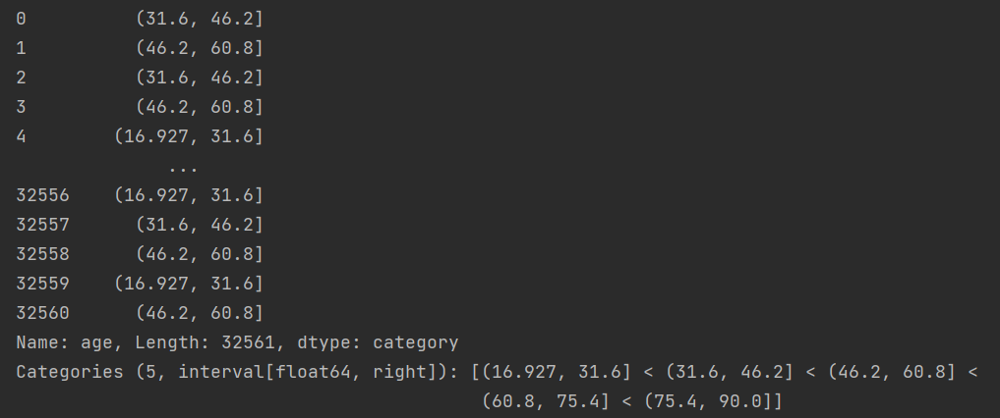
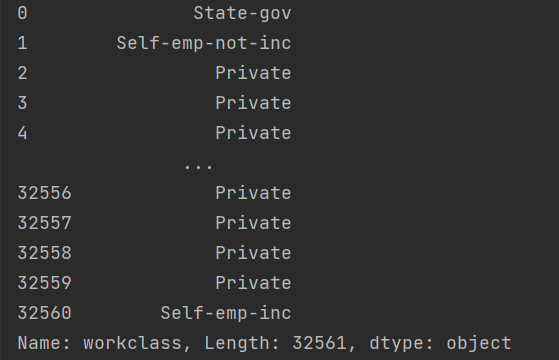
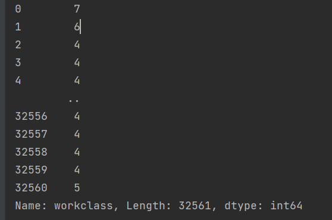
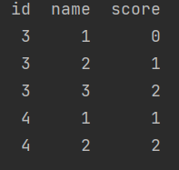
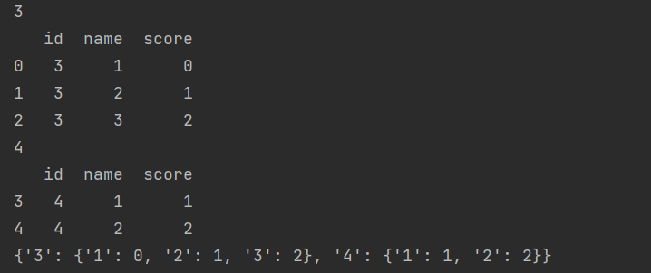

# os

- 当前路径
```buildoutcfg
os.path.abspath(".")   # 返回一个字符串，为当前路径
```
- 当前路径下所有文件
```buildoutcfg
os.listdir(path) # 返回一个文件列表，path为自己的路径
```

- 检查路径是否存在

```buildoutcfg
os.path.exists(path)  # 返回一个布尔值
```

- 创建一个文件夹
```buildoutcfg
if not os.path.exists(path):
    '''如果文件夹不存在则创建'''
    os.makedirs(path)
```

# pandas 相关

数据集为income_classification.csv。
- 读取数据：
```buildoutcfg
data = pd.read_csv("income_classification.csv")  # 参数header表示将某行数据作为列名。names表示列名，接受array
````
- 连续型数据离散化(以'age'属性为例)
```buildoutcfg
data['age'] = pd.cut(data['age'], bins=5) # 分为5类
```
效果如图:


- 处理字符串类型的属性，数字编码
```buildoutcfg
'''
workclass 工作性质，字符串
对属性是字符串的任意特征进行数字编号处理，整数序列从0开始增长
'''
print(data['workclass'])  # 读取原始数据
list1 = pd.get_dummies(data['workclass']).columns  # 首先进行哑变量处理，变为一个稀疏矩阵，列名为原属性的所有取值，再用.columns取出所有的列名，返回列表
classmap = {key: value for value, key in enumerate(list1)}  # 生成一个字典推导式
data['workclass'] = data['workclass'].map(classmap)  # 进行字符编码处理
print(data['workclass'])
```
处理结果如下：

&ensp; &ensp; &ensp; &ensp; 



- 数据的分组与聚合操作

假设数据如下所示：



利用groupdy机制进行分组聚合操作
```buildoutcfg
dict1 = {}
for name, data in data.groupby('id'):
    print(name)
    print(data)
    name = str(name)
    dict1[name] = {str(key): value for key, value in zip(data['name'], data['score'])}
print(dict1)

```
输出结果如下:




