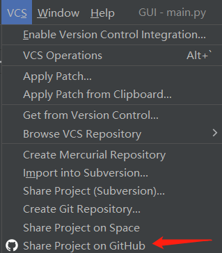
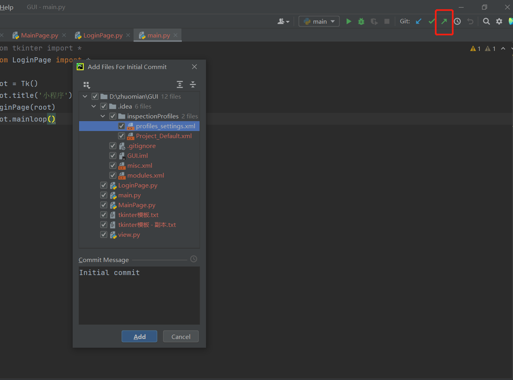

- 环境搭建

https://blog.csdn.net/complected/article/details/116432694?utm_medium=distribute.pc_relevant.none-task-blog-2~default~baidujs_title~default-4.no_search_link&spm=1001.2101.3001.4242.3

- 推送

1、pycharm上仓库创建

2、项目推送

